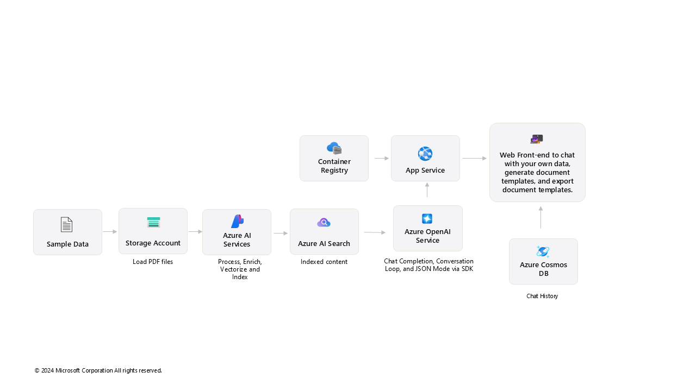

# Document generation solution accelerator

This solution accelerator is a powerful tool that helps you create your own AI assistant for document generation. The accelerator can be used by any customer looking for reusable architecture and code snippets to build an AI assistant to generate a sample template and content grounded on their own enterprise data. 

This example focuses on a generic use case - chat with your own data, generate a document template using your own data, and exporting the document in a docx format.

 

  
[**SOLUTION OVERVIEW**](#solution-overview)  \| [**QUICK DEPLOY**](#quick-deploy)  \| [**BUSINESS USE CASE**](#business-use-case)  \| [**SUPPORTING DOCUMENTATION**](#supporting-documentation)

 

<h2>
Solution overview
</h2>

It leverages Azure OpenAI Service and Azure AI Search, to identify relevant documents, summarize unstructured information, and generate document templates. 

The sample data is sourced from generic AI-generated promissory notes.The documents are intended for use as sample data only.

### Solution architecture
||
|---|

 

### Additional resources

[Azure OpenAI Service](https://learn.microsoft.com/en-us/azure/ai-services/openai/) 

[Azure AI Search](https://learn.microsoft.com/en-us/azure/search/) 

[Azure AI Foundry](https://learn.microsoft.com/en-us/azure/ai-studio/)

 

### Key features

  
Click to learn more about the key features this solution enables

  - **Semantic search**  
  Azure AI Search to enable RAG and grounding of the application on the processed dataset.​
  
  - **Summarization**  
  Azure OpenAI Service and GPT models to help summarize the search content and answer questions.​

  - **Content generation**  
  Azure OpenAI Service and GPT models tohelp generate relevant content with Prompt Flow.​
     

  
<h2>
Quick deploy
</h2>

### How to install or deploy
Follow the quick deploy steps on the deployment guide to deploy this solution to your own Azure subscription.

[Click here to launch the deployment guide](./docs/DeploymentGuide.md)
  

|  |  | 
|---|---|

 

> ⚠️ **Important: Check Azure OpenAI Quota Availability**
  To ensure sufficient quota is available in your subscription, please follow [quota check instructions guide](./docs/QuotaCheck.md) before you deploy the solution.

 

### Prerequisites and costs

To deploy this solution accelerator, ensure you have access to an [Azure subscription](https://azure.microsoft.com/free/) with the necessary permissions to create **resource groups, resources, app registrations, and assign roles at the resource group level**. This should include Contributor role at the subscription level and  Role Based Access Control role on the subscription and/or resource group level. Follow the steps in [Azure Account Set Up](./docs/AzureAccountSetUp.md).

Check the [Azure Products by Region](https://azure.microsoft.com/en-us/explore/global-infrastructure/products-by-region/?products=all&regions=all) page and select a **region** where the following services are available.

Pricing varies per region and usage, so it isn't possible to predict exact costs for your usage. The majority of the Azure resources used in this infrastructure are on usage-based pricing tiers. However, Azure Container Registry has a fixed cost per registry per day.

Use the [Azure pricing calculator](https://azure.microsoft.com/en-us/pricing/calculator) to calculate the cost of this solution in your subscription. 

Review a [sample pricing sheet](https://azure.com/e/2402502429fc46429e395e0bb93d0711) in the event you want to customize and scale usage.

_Note: This is not meant to outline all costs as selected SKUs, scaled use, customizations, and integrations into your own tenant can affect the total consumption of this sample solution. The sample pricing sheet is meant to give you a starting point to customize the estimate for your specific needs._

 

| Product | Description | Cost |
|---|---|---|
| [Azure AI Foundry](https://learn.microsoft.com/en-us/azure/ai-foundry/) | Free tier. Build generative AI applications on an enterprise-grade platform. | [Pricing](https://azure.microsoft.com/pricing/details/ai-studio/) |
| [Azure AI Search](https://learn.microsoft.com/en-us/azure/search/) | Standard tier, S1. Pricing is based on the number of documents and operations. Information retrieval at scale for vector and text content in traditional or generative search scenarios. | [Pricing](https://azure.microsoft.com/pricing/details/search/) |
| [Azure Storage Account](https://learn.microsoft.com/en-us/azure/storage/blobs/) | Standard tier, LRS. Pricing is based on storage and operations. Blob storage in the clopud, optimized for storing massive amounts of unstructured data. | [Pricing](https://azure.microsoft.com/pricing/details/storage/blobs/) |
| [Azure Key Vault](https://learn.microsoft.com/en-us/azure/key-vault/) | Standard tier. Pricing is based on the number of operations. Maintain keys that access and encrypt your cloud resources, apps, and solutions. | [Pricing](https://azure.microsoft.com/pricing/details/key-vault/) |
| [Azure AI Services](https://learn.microsoft.com/en-us/azure/ai-services/) | S0 tier, defaults to gpt-4o and text-embedding-ada-002 models. Pricing is based on token count. | [Pricing](https://azure.microsoft.com/pricing/details/cognitive-services/) |
| [Azure Container App](https://learn.microsoft.com/en-us/azure/container-apps/) | Consumption tier with 0.5 CPU, 1GiB memory/storage. Pricing is based on resource allocation, and each month allows for a certain amount of free usage. Allows you to run containerized applications without worrying about orchestration or infrastructure. | [Pricing](https://azure.microsoft.com/pricing/details/container-apps/) |
| [Azure Container Registry](https://learn.microsoft.com/en-us/azure/container-registry/) | Basic tier. Build, store, and manage container images and artifacts in a private registry for all types of container deployments | [Pricing](https://azure.microsoft.com/pricing/details/container-registry/) |
| [Log analytics](https://learn.microsoft.com/en-us/azure/azure-monitor/) | Pay-as-you-go tier. Costs based on data ingested. Collect and analyze on telemetry data generated by Azure. | [Pricing](https://azure.microsoft.com/pricing/details/monitor/) |
| [Azure Cosmos DB](https://learn.microsoft.com/en-us/azure/cosmos-db/) | Fully managed, distributed NoSQL, relational, and vector database for modern app development. | [Pricing](https://azure.microsoft.com/en-us/pricing/details/cosmos-db/autoscale-provisioned/) |

 

>⚠️ **Important:** To avoid unnecessary costs, remember to take down your app if it's no longer in use,
either by deleting the resource group in the Portal or running `azd down`.

  
<h2>
Business use case
</h2>

||
|---|

 

Put your data to work by reducing blank page anxiety, speeding up document drafting, improving draft document quality, and reference information quickly - keeping experts in their expertise. Draft document templates for your organization including Invoices, End-user Contracts, Purchase Orders, Investment Proposals, and Grant Submissions.

⚠️ The sample data used in this repository is synthetic and generated using Azure OpenAI Service. The data is intended for use as sample data only.

### Business value

  
Click to learn more about what value this solution provides

  - **Draft templates quickly**  
  Put your data to work to create any kind of document that is supported by a large data library.

  - **Share**  
  Share with coauthors, contributors and approvers quickly. 

  - **Contextualize information**  
  Provide context using natural language. Primary and secondary queries allow for access to supplemental detail – reducing cognitive load, increasing efficiency, and enabling focus on higher value work.

  - **Gain confidence in responses**  
  Trust responses to queries by customizing how data is referenced and returned to users, reducing the risk of hallucinated responses.  Access reference documents in the same chat window to get more detail and confirm accuracy.

  - **Secure data and responsible AI for innovation**  
  Improve data security to minimize breaches, fostering a culture of responsible AI adoption, maximize innovation opportunities, and sustain competitive edge.

     

  

<h2>
Supporting documentation
</h2>

### Security guidelines

This template uses Azure Key Vault to store all connections to communicate between resources.

This template also uses [Managed Identity](https://learn.microsoft.com/entra/identity/managed-identities-azure-resources/overview) for local development and deployment.

To ensure continued best practices in your own repository, we recommend that anyone creating solutions based on our templates ensure that the [Github secret scanning](https://docs.github.com/code-security/secret-scanning/about-secret-scanning) setting is enabled.

You may want to consider additional security measures, such as:

* Enabling Microsoft Defender for Cloud to [secure your Azure resources](https://learn.microsoft.com/azure/security-center/defender-for-cloud).
* Protecting the Azure Container Apps instance with a [firewall](https://learn.microsoft.com/azure/container-apps/waf-app-gateway) and/or [Virtual Network](https://learn.microsoft.com/azure/container-apps/networking?tabs=workload-profiles-env%2Cazure-cli).

 

### Cross references
Check out similar solution accelerators
 
| Solution Accelerator | Description |
|---|---|
| [Chat&nbsp;with&nbsp;your&nbsp;data](https://github.com/Azure-Samples/chat-with-your-data-solution-accelerator) | Chat with their own data by combining Azure Cognitive Search and Large Language Models (LLMs) to create a conversational search experience. It enables increased user efficiency by minimizing endpoints required to access internal company knowledgebases. |
| [Document&nbsp;knowledge&nbsp;mining](https://github.com/microsoft/Document-Knowledge-Mining-Solution-Accelerator) | Built on Azure OpenAI Service and Azure AI Document Intelligence to process and extract summaries, entities, and metadata from unstructured, multi-modal documents and enable searching and chatting over this data. |
| [Build&nbsp;your&nbsp;own&nbsp;copilot](https://github.com/microsoft/Build-your-own-copilot-Solution-Accelerator) | Helps client advisors to save time and prepare relevant discussion topics for scheduled meetings with overviews, client profile views, and chatting with structured data. |

    

## Provide feedback

Have questions, find a bug, or want to request a feature? [Submit a new issue](https://github.com/microsoft/document-generation-solution-accelerator/issues) on this repo and we'll connect.

 

## Responsible AI Transparency FAQ 
Please refer to [Transparency FAQ](./TRANSPARENCY_FAQ.md) for responsible AI transparency details of this solution accelerator.

 

## Disclaimers

This release is an artificial intelligence (AI) system that generates text based on user input. The text generated by this system may include ungrounded content, meaning that it is not verified by any reliable source or based on any factual data. The data included in this release is synthetic, meaning that it is artificially created by the system and may contain factual errors or inconsistencies. Users of this release are responsible for determining the accuracy, validity, and suitability of any content generated by the system for their intended purposes. Users should not rely on the system output as a source of truth or as a substitute for human judgment or expertise.

This release only supports English language input and output. Users should not attempt to use the system with any other language or format. The system output may not be compatible with any translation tools or services, and may lose its meaning or coherence if translated.

This release does not reflect the opinions, views, or values of Microsoft Corporation or any of its affiliates, subsidiaries, or partners. The system output is solely based on the system's own logic and algorithms, and does not represent any endorsement, recommendation, or advice from Microsoft or any other entity. Microsoft disclaims any liability or responsibility for any damages, losses, or harms arising from the use of this release or its output by any user or third party.

This release does not provide any financial advice, and is not designed to replace the role of qualified client advisors in appropriately advising clients. Users should not use the system output for any financial decisions or transactions, and should consult with a professional financial advisor before taking any action based on the system output. Microsoft is not a financial institution or a fiduciary, and does not offer any financial products or services through this release or its output.

This release is intended as a proof of concept only, and is not a finished or polished product. It is not intended for commercial use or distribution, and is subject to change or discontinuation without notice. Any planned deployment of this release or its output should include comprehensive testing and evaluation to ensure it is fit for purpose and meets the user's requirements and expectations. Microsoft does not guarantee the quality, performance, reliability, or availability of this release or its output, and does not provide any warranty or support for it.

This Software requires the use of third-party components which are governed by separate proprietary or open-source licenses as identified below, and you must comply with the terms of each applicable license in order to use the Software. You acknowledge and agree that this license does not grant you a license or other right to use any such third-party proprietary or open-source components.

To the extent that the Software includes components or code used in or derived from Microsoft products or services, including without limitation Microsoft Azure Services (collectively, “Microsoft Products and Services”), you must also comply with the Product Terms applicable to such Microsoft Products and Services. You acknowledge and agree that the license governing the Software does not grant you a license or other right to use Microsoft Products and Services. Nothing in the license or this ReadMe file will serve to supersede, amend, terminate or modify any terms in the Product Terms for any Microsoft Products and Services.

You must also comply with all domestic and international export laws and regulations that apply to the Software, which include restrictions on destinations, end users, and end use. For further information on export restrictions, visit https://aka.ms/exporting.

You acknowledge that the Software and Microsoft Products and Services (1) are not designed, intended or made available as a medical device(s), and (2) are not designed or intended to be a substitute for professional medical advice, diagnosis, treatment, or judgment and should not be used to replace or as a substitute for professional medical advice, diagnosis, treatment, or judgment. Customer is solely responsible for displaying and/or obtaining appropriate consents, warnings, disclaimers, and acknowledgements to end users of Customer’s implementation of the Online Services.

You acknowledge the Software is not subject to SOC 1 and SOC 2 compliance audits. No Microsoft technology, nor any of its component technologies, including the Software, is intended or made available as a substitute for the professional advice, opinion, or judgement of a certified financial services professional. Do not use the Software to replace, substitute, or provide professional financial advice or judgment.

BY ACCESSING OR USING THE SOFTWARE, YOU ACKNOWLEDGE THAT THE SOFTWARE IS NOT DESIGNED OR INTENDED TO SUPPORT ANY USE IN WHICH A SERVICE INTERRUPTION, DEFECT, ERROR, OR OTHER FAILURE OF THE SOFTWARE COULD RESULT IN THE DEATH OR SERIOUS BODILY INJURY OF ANY PERSON OR IN PHYSICAL OR ENVIRONMENTAL DAMAGE (COLLECTIVELY, “HIGH-RISK USE”), AND THAT YOU WILL ENSURE THAT, IN THE EVENT OF ANY INTERRUPTION, DEFECT, ERROR, OR OTHER FAILURE OF THE SOFTWARE, THE SAFETY OF PEOPLE, PROPERTY, AND THE ENVIRONMENT ARE NOT REDUCED BELOW A LEVEL THAT IS REASONABLY, APPROPRIATE, AND LEGAL, WHETHER IN GENERAL OR IN A SPECIFIC INDUSTRY. BY ACCESSING THE SOFTWARE, YOU FURTHER ACKNOWLEDGE THAT YOUR HIGH-RISK USE OF THE SOFTWARE IS AT YOUR OWN RISK.  